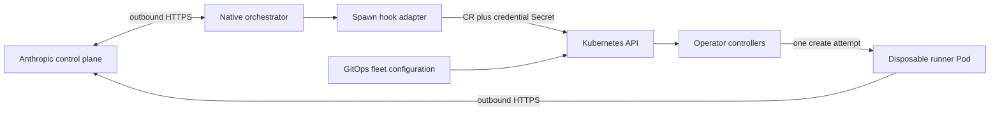

# Proposed architecture

There is no implemented architecture yet. The [design](../changes/build-kubernetes-operator/design.md)
proposes two namespaced APIs: `ClaudeRunnerFleet` for installation configuration and `ClaudeWorkOrder`
for durable receipt and lifecycle of one spawn request.

The hook returns after durable receipt, not after Pod startup. The operator reconciles receipt,
submission, observed Pod state and cleanup. Kubernetes running state does not prove Anthropic registration.
Generic installation tooling supplies CRDs and the manager; downstream GitOps owns only fleet intent
and referenced inputs. It must not manage generated runtime resources independently.
